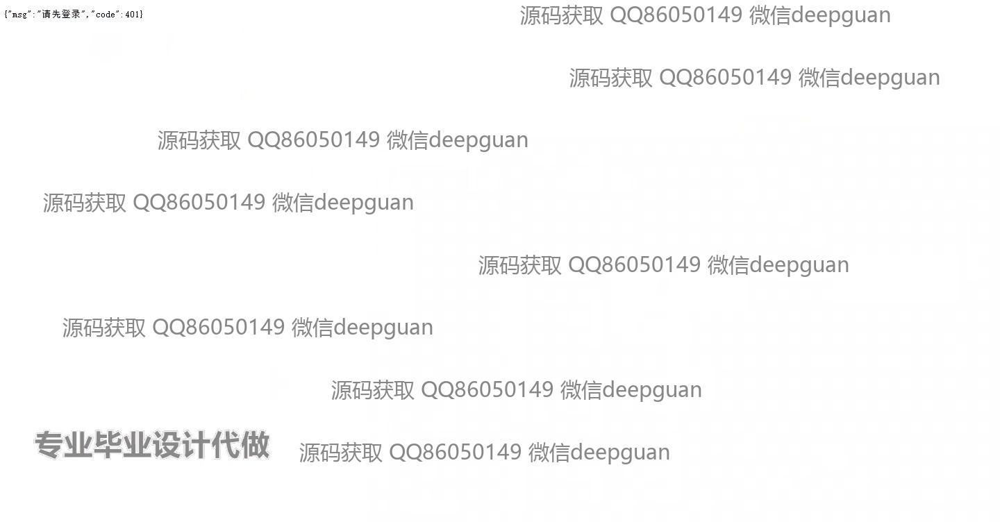
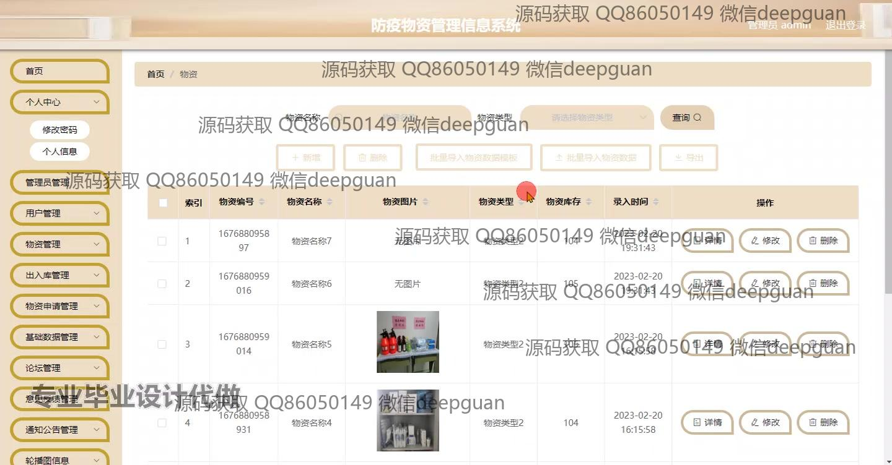
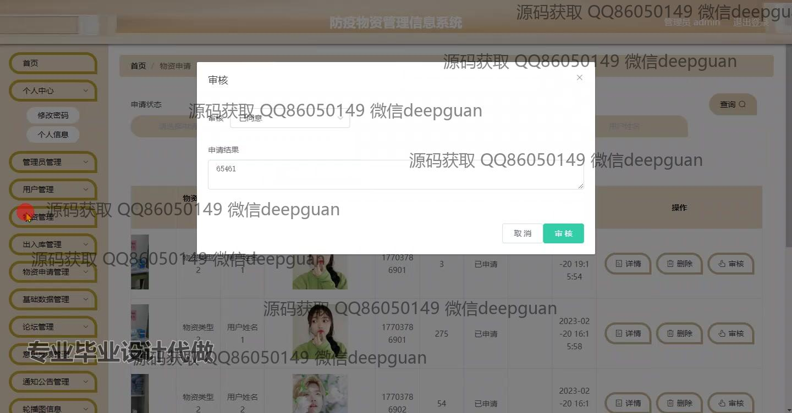

<h1 align="center">防疫物资管理信息系统</h1>

## 简介
防疫物资管理信息系统：角色分为管理员、用户，功能包括物资申请管理、出入库管理、用户信息管理、数据统计分析，支持实时更新和权限管理。适用于疫情防控物资的调配和管理。    --计算机毕业设计源码；毕设源码；java毕业设计源码

## 联系方式

<h3 align="center">获取完整代码与数据库文件 + 微信：deepguan QQ: 86050149 QQ群: 783742310</h3>

<h3 align="center">可帮忙远程部署 包运行成功！提供远程部署、修改代码、设计文档指导、代码讲解等服务！</h3>

## 功能介绍（完整见运行截图）
管理员：基本功能包括登录、注册、退出，以及管理员权限的管理和分配。在系统中，管理员能够管理用户信息，包括查看、修改、删除和重置密码等操作。管理员还能对防疫物资进行全面管理，包括物资的录入、查询、更新、删除及库存的实时调整。管理员负责审核物资申请，操作出入库管理功能，并发布与管理通知公告。

用户：基本功能包括登录、注册和退出。用户可以通过系统申请防疫物资，并查看相关申请状态和历史记录。在个人中心，用户能够查看和更新个人信息。用户界面友好，允许用户快速查询物资信息，包括物资的编号、名称、类型、库存数量及入库时间等详细信息。用户还可以利用系统提供的搜索、导入和导出功能有效管理物资。

## 运行截图

本代码来源于网络,仅供学习参考使用!

